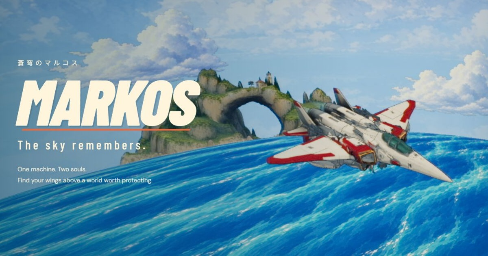

# MARKOS — The sky remembers

A browser flight demo inspired by painted 1980s–90s anime OVAs. Pilot the MK–01 over a spherical archipelago, transform into a robot in midair, intercept six drones and return to the Halcyon carrier.

[Play MARKOS](https://markos.asfarlab.fun)



## Play

Choose **Begin sortie** for the mission, **Free flight** to explore 16 island destinations, or **Inspect aircraft** to see the transforming airframe up close. A keyboard or standard Xbox/PlayStation-compatible controller and a WebGL2-capable browser are required. Touchscreen flight controls are not implemented.

The opening screen loads the assets. **Enter the sky** starts the soundtrack through a browser-approved interaction and reveals the title screen. If sound is blocked, retry or continue quietly. A controller may still require an initial click or keyboard press for audio activation.

## Run locally

Use Node.js 22.18 or newer and npm. Tests and verification tools import the TypeScript sources directly through Node's built-in type stripping.

```sh
npm ci
npm run dev
```

Open the Vite URL printed in the terminal, normally `http://localhost:5173`. Runtime models, baked textures, music and English radio recordings are included; no generation API keys or Blender installation are needed to play, build or verify the demo.

```sh
npm test             # Fast unit tests
npm run verify       # Unit tests plus asset, animation, flight, collision and camera checks
npm run lint         # ESLint
npm run format       # Prettier (format:check only reports)
npm run typecheck    # tsc
npm run build        # Type-check, compress and hash assets, build into dist/
npm run check-build  # Confirm every deployed asset is hashed and each compressed model matches its export
npm run preview      # Serve the production build locally
```

Verification writes reports under the ignored `output/verification/` directory. The GitHub Actions workflow in `.github/workflows/ci.yml` runs lint, formatting, type-check, verification, build and the build check on Node 22 and 24.

## Controls

| Action                                | Controller (standard mapping) | Keyboard      |
| ------------------------------------- | ----------------------------- | ------------- |
| Steer / climb / dive / loop           | Left stick                    | WASD / arrows |
| Orbit the camera in any direction     | Right stick                   | Q / E sideways, I / K vertical |
| Boost                                 | LT                            | Shift         |
| Fire                                  | RT                            | Space         |
| Transform                             | A / Cross                     | F             |
| Airbrake                              | B / Circle                    | Ctrl          |
| Chase / wide / close / Wingman camera | Y / Triangle                  | V             |
| Barrel roll                           | LB / RB                       | Z / X         |
| Track objective / contact              | Hold X / Square               | Hold T        |
| Choose landmark (Free flight)          | D-pad left / right            | [ / ]         |
| Rear view                             | Right-stick orbit             | Hold C        |
| Return camera                         | Click right stick             | R             |
| Pause                                 | Start / Options               | Escape        |
| Mute                                  | Screen button                 | M             |
| Hide instruments                      | —                             | H             |

Both **Invert flight Y-axis** and **Invert camera Y-axis** default to on and can be changed independently in Pause. **Analog finish** defaults to 75%: soft blur, colour bleed, a shadow echo and faded washes, without scanlines. Saved preferences are respected; **Reset settings** restores these defaults.

Distant sortie gates and the carrier use horizon-aware guidance around the spherical sea. Once visible, their markers return to the actual approach points.

The right stick or Q/E/I/K controls camera orbit. Hold X / Square or T to track the current objective, contact or free-flight landmark. Manual orbit takes priority. Camera return, sensitivity, camera style and audio volume are adjustable in Pause. Disconnecting a controller pauses flight.

Hard terrain and sea impacts destroy the aircraft. In fully transformed robot mode, brake for a slow, upright approach to land: gentle contact preserves the airframe. Fast robot impacts, cliffs and water remain dangerous. Gentle contact is a flight/skim interaction; ground walking is not implemented.

## Project layout

- `src/main.ts` — the conductor: renderer, loading, mode presentation, flight integration and the frame loop.
- `src/session.ts`, `src/mission.ts`, `src/combat.ts` — screen flow, objectives and progression, drones and bolts.
- `src/hud.ts`, `src/effects.ts`, `src/contrail.ts`, `src/settings-panel.ts` — instruments, sparks, vapour trails and the pause-menu bindings.
- `src/camera.ts`, `src/terrain-contact.ts`, `src/asset-world.ts`, `src/audio.ts`, `src/input.ts` — chase camera, swept collision, the exported world, sound and controls.
- `src/flight.ts`, `src/navigation.ts`, `src/landmarks.ts`, `src/targeting.ts`, `src/preferences.ts` — pure logic covered by the unit tests.
- `public/` — canonical runtime Blender exports, baked paint, audio and social metadata.
- `tests/` — unit tests using Node's test runner.
- `tools/verify-*.mjs` — checks against the actual exported meshes, rigs and animations; `tools/verify.mjs` runs them all.
- `tools/asset-pipeline.mjs`, `tools/check-build.mjs` — build-time model compression and hashing, and the gate that checks the result.
- `docs/ASSETS.md` — art pipeline, included exports and dependency notices.
- `wrangler.jsonc` — Cloudflare static-asset deployment configuration.

The editable Blender archive, model-generation intermediates, prompts, screenshots, session notes and deployment logs remain local and are excluded from this public checkout. See [asset notes](docs/ASSETS.md) for the scope of the included art.

## Deployment

The existing configuration targets `markos.asfarlab.fun`. To deploy your own copy, change the Worker name and custom-domain route in `wrangler.jsonc`, and update the canonical/social URLs in `index.html`, `public/robots.txt` and `public/sitemap.xml`.

Authenticate Wrangler to the intended Cloudflare account, then run:

```sh
npm run deploy
```

This verifies, builds, checks the build and publishes `dist/`. Credentials belong in your local environment or deployment service's secret settings. The game has no server-side generation calls. `public/.assetsignore` excludes development reports and intermediate paint images from Worker uploads.

The production build compresses the large Blender exports with meshopt and renames every runtime model, sound and texture with a content hash, so `public/_headers` marks them immutable. Collision meshes, the painted ocean and the small effect meshes are copied unchanged because the runtime reads their raw vertex data. Compressed models are cached under the ignored `.cache/assets/` directory; `public/` stays byte-identical to the Blender exports.

## Demo status

This is an early playable demo. Generated mesh reconstruction still has visible irregularities, water collision uses the mean sea level beneath the visual swells, and physical-controller feel, rumble and performance on a range of real GPUs still need hands-on testing. Automated geometry and camera checks do not replace those playtests.

No project-wide open-source licence has been selected. Third-party libraries and fonts retain their own licences; see [asset and dependency notices](docs/ASSETS.md).
